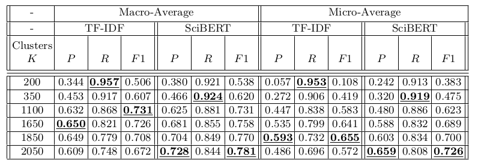
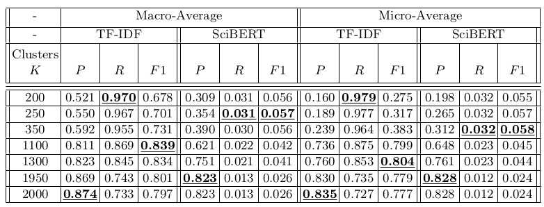

# ORKG-NLP Service Template

## Overview

### Aims
This service aims to foster constructing the ORKG using predefined set of predicates existing in the graph.
This directs ORKG users to converge towards selecting predicates added by domain experts while not preventing
them from adding new ones / selecting other ones, as the crowdsourcing concept of the ORKG suggests. Note that this
service and the
[``Templates Recommendation service``](https://gitlab.com/TIBHannover/orkg/nlp/experiments/orkg-templates-recommendation)
serve the same purpose, but from different perspectives. 

### Approach
Based on the created [dataset](#dataset), we consider a comparison comparing a group of papers by a set of predicates
a group of semantically similar papers that could be represented as a **cluster** of papers. Thus, we apply
[K-means](https://scikit-learn.org/stable/modules/clustering.html#k-means) and 
[Agglomerative](https://scikit-learn.org/stable/modules/generated/sklearn.cluster.AgglomerativeClustering.html)
clustering algorithms on our dataset after converting a paper textual representation to 
[SciBERT](https://aclanthology.org/D19-1371/) or
[TF-IDF](https://scikit-learn.org/stable/modules/generated/sklearn.feature_extraction.text.TfidfVectorizer.html)
vectors.

When a new coming paper gets assigned to one of the paper clusters, the comparisons of the included papers in that
cluster will be intermediately obtained which in turn lead to sets of compared predicates. The output of the service 
is the union of the compared predicates sets.

### Dataset
The dataset is created by fetching papers from those ORKG Comparisons having more than **10** contributions to 
be considered loosely as an evolving template pattern or as part of valid semantic group.

### Evaluation
Per the standard evaluation practice of information retrieval systems, we employed the macro- as well as the 
micro-average of the precision (P), recall (R) and F-score (F1).

#### Experimental Setup

First, we created training and test dataset splits of our task corpus. From each comparison, we split its papers in
the `70:30` ratio for creating training and test datasets, respectively. The test dataset was reserved as a blind set
with which the trained algorithm was queried for its predictions of clustered predicate groups. In total, 
our training set consisted of `3,696` contributions distributed over `192` comparisons, whereas our test set had `1,427` 
contributions distributed over `167` comparisons. The training and test sets contain mutually unique instances.

$`K`$ was strategically chose in the range  $`|C| \leq k \leq |P|`$ with a step size of `50`, where $`C=200`$ is the set of
ORKG comparisons and $`P=2050`$ is the set of training papers. `38` total models were obtained per vectorization method.

Some considerations need to be taken w.r.t. evaluating our clustering models. We put emphasis on the absence of the
prediction function in the agglomerative algorithm compared to its presence in K-means that can simply assign a new
incoming data instance to one of the clusters based on the distance to the centroid. In hierarchical clustering on the
other hand, assigning a new data instance can entirely change the clusters because it can trigger several mergings based
on the linkage measure. In order to avoid re-building the hierarchical clusters for each test instance, we build them
only once on the entire dataset and evaluate by comparing the comparisons' predicates of the training papers included in
the cluster to which a test instance is assigned with the expected ones. 

#### Results

* Results of automatically generating contribution predicates groups using **K-means** clustering. K was chosen in the range from 200 to 2050 in step sizes of 50. The
table shows the most significant results obtained in terms of P , R, and F 1.


* Results of automatically generating contribution predicates groups using **Agglomerative**
   clustering. K was chosen in the range from 200 to 2050 in step sizes of 50. The
   table shows the most significant results obtained in terms of P , R, and F 1.


## Contribution
This service is developed and maintained by

* Arab Oghli, Omar <omar.araboghli@tib.eu>

under supervision of
* D'Souza, Jennifer <jennifer.dsouza@tib.eu>
* Auer, Sören <auer@tib.eu>

## License
[MIT](./LICENSE)

## How to Cite

```bibtex
@misc{https://doi.org/10.48550/arxiv.2210.02034,
  doi = {10.48550/ARXIV.2210.02034},
  
  url = {https://arxiv.org/abs/2210.02034},
  
  author = {Arab Oghli, Omar and D'Souza, Jennifer and Auer, Sören},
  
  keywords = {Digital Libraries (cs.DL), Artificial Intelligence (cs.AI), FOS: Computer and information sciences, FOS: Computer and information sciences},
  
  title = {Clustering Semantic Predicates in the Open Research Knowledge Graph},
  
  publisher = {arXiv},
  
  year = {2022},
  
  copyright = {Creative Commons Attribution 4.0 International}
}

```

## References

* [Clustering Semantic Predicates in the Open Research Knowledge Graph](https://doi.org/10.48550/arXiv.2210.02034)
* [Information Retrieval Service Aspects of the Open Research Knowledge Graph](https://doi.org/10.15488/11834)
* [SciBERT: A Pretrained Language Model for Scientific Text](https://aclanthology.org/D19-1371/)
