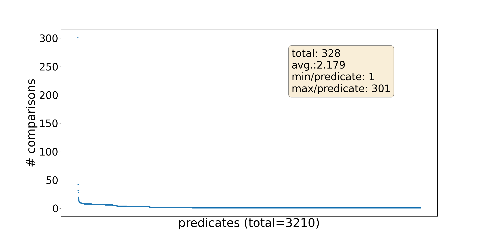

# ORKG-NLP Service Template

## Overview

### Aims
This service aims to foster constructing the ORKG using predefined set of predicates existing in the graph.
This directs ORKG users to converge towards selecting predicates added by domain experts while not preventing
them from adding new ones / selecting other ones, as the crowdsourcing concept of the ORKG suggests. Note that this
service and the
[``Templates Recommendation service``](https://gitlab.com/TIBHannover/orkg/nlp/experiments/orkg-templates-recommendation)
serve the same purpose, but from different perspectives. 

### Approach
Based on the created [dataset](#dataset), we consider a comparison comparing a group of papers by a set of predicates
a group of semantically similar papers that could be represented as a **cluster** of papers. Thus, we apply
[K-means](https://scikit-learn.org/stable/modules/clustering.html#k-means) and 
[Agglomerative](https://scikit-learn.org/stable/modules/generated/sklearn.cluster.AgglomerativeClustering.html)
clustering algorithms on our dataset after converting a paper textual representation to 
[SciBERT](https://aclanthology.org/D19-1371/) or
[TF-IDF](https://scikit-learn.org/stable/modules/generated/sklearn.feature_extraction.text.TfidfVectorizer.html)
vectors.

When a new coming paper gets assigned to one of the paper clusters, the comparisons of the included papers in that
cluster will be intermediately obtained which in turn lead to sets of compared predicates. The output of the service 
is the union of the compared predicates sets.


### Dataset
The dataset is created by fetching ``compared`` papers from those ORKG Comparisons having more than **N** contributions to 
be considered loosely as an evolving template pattern or as part of valid semantic group. **N** is denoted with the 
constant ``CONTRIBUTIONS_PER_COMPARISON_THRESHOLD`` in the script `src/data/fetch_compared_papers.py`. Additionally,
we fetched ``uncompared`` papers that have a similar distribution to the compared ones, that we can utilize for the 
negative case by creating clusters of uncompared papers that map to an empty list of predicates.

Papers abstracts were fetched from the [ORKG papers dump](https://gitlab.com/TIBHannover/orkg/orkg-abstracts/).

#### Statistics 
> The following statistics are manually summarized based on the output of `src.data.main.py` script.

| Comparisons | ``Compared`` Papers | ``Uncompared`` Papers | ``Compared`` Contributions | ``Uncompared`` Contributions | ``Compared`` Research Fields | ``Uncompared`` Research Fields |
|:-----------:|:-------------------:|:---------------------:|:--------------------------:|:----------------------------:|:----------------------------:|:------------------------------:|
|     329     |        3030         |         1515          |            6866            |             2264             |              8               |              126               |


|       -       | [Dataset](data/processed/dataset.json) | [Training](data/processed/training_set.json) |  [Test](data/processed/test_set.json)  |
|:-------------:|:--------------------------------------:|:--------------------------------------------:|:--------------------------------------:|
|  Comparisons  |                  329                   |                     329                      |                  237                   |
|    Papers     |                  4545                  |                     3176                     |                  1369                  |
| Contributions |                  9130                  |                     4527                     |                  1876                  |

[More details](data/processed/split_statistics.txt)

#### Plots

##### Grouped by ``Comparisons``

* [Statistics Summary](data/processed/by_comparison/statistics.txt)
* [Statistics per Comparison](data/processed/by_comparison/statistics.csv)

|                                                                                                                                                                                                                 |                                                                                                                                                                                                              |
|:---------------------------------------------------------------------------------------------------------------------------------------------------------------------------------------------------------------:|:------------------------------------------------------------------------------------------------------------------------------------------------------------------------------------------------------------:|
|        <figcaption align = "center">Fig.1 - Predicates distribution over Comparisons</b></figcaption>        |   <br/><figcaption align = "center">Fig.2 - Contributions distribution over Comparisons</figcaption>   |
|            <figcaption align = "center">Fig.3 - Papers distribution over Comparisons</b></figcaption>            | <br/><figcaption align = "center">Fig.4 - Research fields distribution over Comparisons</figcaption> |
| <figcaption align = "center">Fig.5 - Research problems distribution over Comparisons</b></figcaption> |              <br/><figcaption align = "center">Fig.6 - All distributions over Comparisons</figcaption>              |


##### Grouped by ``Predicates``

* [Statistics Summary](data/processed/by_predicate/statistics.txt)
* [Statistics per Predicate](data/processed/by_predicate/statistics.csv)

|                                                                                                                                                                                                               |                                                                                                                                                                                                            |
|:-------------------------------------------------------------------------------------------------------------------------------------------------------------------------------------------------------------:|:----------------------------------------------------------------------------------------------------------------------------------------------------------------------------------------------------------:|
|       <figcaption align = "center">Fig.1 - Comparisons distribution over Predicates</b></figcaption>       |   <br/><figcaption align = "center">Fig.2 - Contributions distribution over Predicates</figcaption>   |
|            <figcaption align = "center">Fig.3 - Papers distribution over Predicates</b></figcaption>            | <br/><figcaption align = "center">Fig.4 - Research fields distribution over Predicates</figcaption> |
| <figcaption align = "center">Fig.5 - Research problems distribution over Predicates</b></figcaption> |             <br/><figcaption align = "center">Fig.6 - All distributions over Comparisons</Predicates>              |


### Evaluation
Per the standard evaluation practice of information retrieval systems, we employed the macro- as well as the 
micro-average of the precision (P), recall (R) and F-score (F1).

#### Experimental Setup

First, we created training and test dataset splits of our task corpus. From each comparison, we split its papers in
the `70:30` ratio for creating training and test datasets, respectively. The test dataset was reserved as a blind set
with which the trained algorithm was queried for its predictions of clustered predicate groups. In total, 
our training set consisted of `4,527` contributions distributed over `329` comparisons, whereas our test set had `1,876` 
contributions distributed over `237` comparisons. The training and test sets contain mutually unique instances.

$`K`$ was strategically chose in the range  $`|C| \leq k \leq |P|`$ with a step size of `50`, where $`C=400`$ is the set of
ORKG comparisons and $`P=3150`$ is the set of training papers.

Some considerations need to be taken w.r.t. evaluating our clustering models. We put emphasis on the absence of the
prediction function in the agglomerative algorithm compared to its presence in K-means that can simply assign a new
incoming data instance to one of the clusters based on the distance to the centroid. In hierarchical clustering on the
other hand, assigning a new data instance can entirely change the clusters because it can trigger several mergings based
on the linkage measure. In order to avoid re-building the hierarchical clusters for each test instance, we build them
only once on the entire dataset and evaluate by comparing the comparisons' predicates of the training papers included in
the cluster to which a test instance is assigned with the expected ones. 

#### Results
In the following summary table we show the best selected model for each approach. Please note that we select the best 
model based on the highest ``micro-F1`` value, since micro-averaging gives insights on predicates and not on
comparisons level. Please also note the following baselines:

1. $`Base_{RF}`$: Hereby the clusters were created based on the **research fields** of the papers.
2. $`Base_{LDA}`$: Hereby the clusters were made based on the **Latent Dirichlet Allocation** algorithm. A topic is an equivalent to a cluster.


|               Approach               | macro-F1 |  micro-F1  |
|:------------------------------------:|:--------:|:----------:|
|            $`Base_{RF}`$             | `22.23%` |  `5.82%`   |
|            $`Base_{LDA}`$            | `5.35%`  |  `2.52%`   |
|    $`KMeans_{SciBERT}^{k=3150}`$     | `68.19%` | **58.05%** |
|     $`KMeans_{TFIDF}^{k=1250}`$      | `61.59%` |  `36.76%`  |
|  $`Agglomerative_{TFIDF}^{k=2050}`$  | `85.93%` | **62.64%** |
| $`Agglomerative_{SciBERT}^{k=1850}`$ | `6.78%`  |  `5.21%`   |

[More details](data/results)


### Limitations 
Due to the complex time and space requirements of K-means, we use Google Colab for training and evaluating the models.
Please find those under [`/notebooks`](notebooks).

## How to Run

### Prerequisites

#### Software Dependencies
* Python version ``^3.7.1,<3.10``

#### Hardware Resources
These resources were provided on an instance of Google Colab and were partially used to train the K-means models.
* RAM ``~23 GB``
* Storage ``107 GB`` 
* Processor ``CPU``

### Cloning the repository

```commandline
git clone https://gitlab.com/TIBHannover/orkg/nlp/experiments/orkg-templates-recommendation.git
cd orkg-templates-recommendation
pip install -r requirements.txt
```

The repository includes the python script `src/main.py` which is a commandline tool responsible for doing all possible
tasks. The tool has the following syntax: 

```commandline
usage: main.py [-h] -t {dataset,evaluate,convert,predict} [-mp MODEL_PATH]
               [-trainp TRAINING_SET_PATH] [-cpp COMPARISONS_PREDICATES_PATH]
               [-q QUERY] [-n N_RESULTS]
```

for full documentation, please type

```commandline
python -m src.main -h
```

### Data Creation

The following command will fetch the data from the ORKG, create a dataset, analyse and split it to train and test
sets. The output folders are fixed and cannot be configured, which are:

* `data/raw/` and
* `data/processed/`.

```commandline
python -m src.main -t dataset
```


### Service Retraining and Evaluation

Please use the notebooks stored under [`/notebooks`](notebooks) for creating SciBERT embeddings, creating the clusters,
evaluating the models and finally apply cluster analysis on selected ones.

Note: For running the notebooks on Google Colab you will need to connect your Google Drive and Google Storage Cloud
accounts with the notebooks by providing your `MAIN_DRIVE_DIR` and `BUCKET` names, respectively.

#### Model Selection
To select the best model, please download the resulting output files from your Google Drive and locate them under
`/data/results`. Then run the following command to see the best model of each approach selected:

```commandline
python -m src.main -t evaluate
```

#### Model Conversion
To convert the selected SciBERT K-means model to an ONNX format, please download the best model from your
Google Storage Cloud and pass it to the conversion script with the following command:

```commandline
python -m src.main -t convert -mp <path to your model>
```

You will find the output `.onnx` file in the same directory of your passed model.

### Service Integration

```commandline
python -m src.main -t predict \
    -mp <path to your model> \
    -trainp <path to the training set> \
    -cpp <path to the comparisons predicates mapping> \
    -q "your text"
```

## Contribution
This service is developed and maintained by

* Arab Oghli, Omar <omar.araboghli@tib.eu>

under supervision of
* D'Souza, Jennifer <jennifer.dsouza@tib.eu>
* Auer, Sören <auer@tib.eu>

## License
[MIT](./LICENSE)

## References

* [Clustering Semantic Predicates in the Open Research Knowledge Graph](https://doi.org/10.48550/arXiv.2210.02034)
* [Information Retrieval Service Aspects of the Open Research Knowledge Graph](https://doi.org/10.15488/11834)
* [SciBERT: A Pretrained Language Model for Scientific Text](https://aclanthology.org/D19-1371/)
