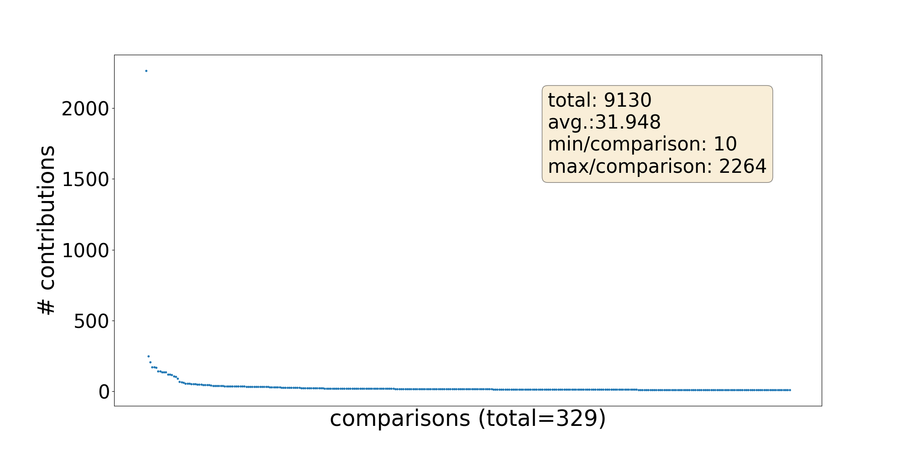
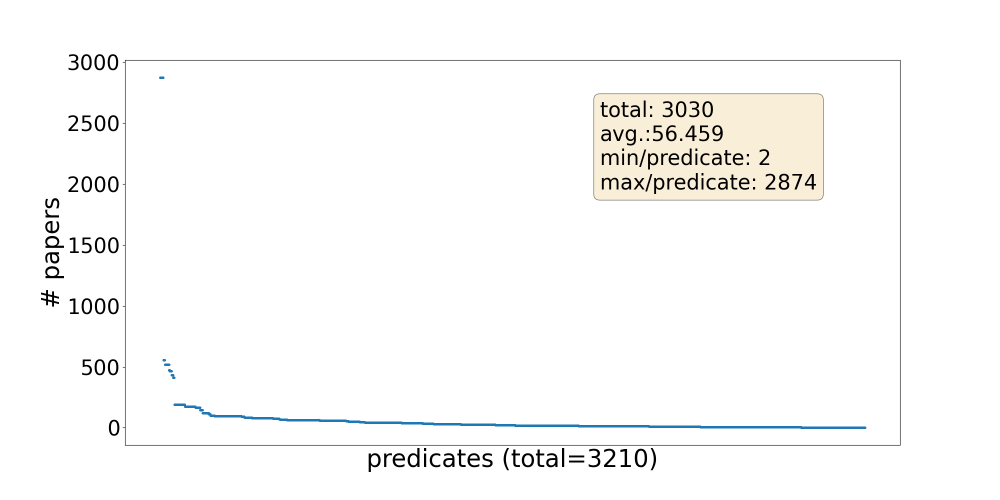
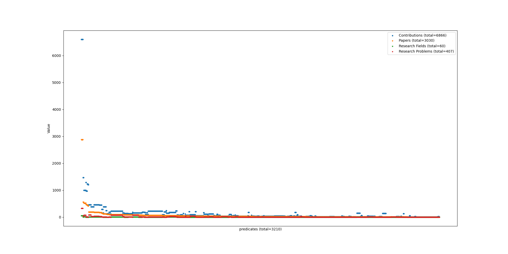

# ORKG-NLP Service Template

## Overview

### Aims
This service aims to foster constructing the ORKG using predefined set of predicates existing in the graph.
This directs ORKG users to converge towards selecting predicates added by domain experts while not preventing
them from adding new ones / selecting other ones, as the crowdsourcing concept of the ORKG suggests. Note that this
service and the
[``Templates Recommendation service``](https://gitlab.com/TIBHannover/orkg/nlp/experiments/orkg-templates-recommendation)
serve the same purpose, but from different perspectives. 

### Approach
TODO: more text

[K-means](https://scikit-learn.org/stable/modules/clustering.html#k-means)
clustering with [SciBERT](https://aclanthology.org/D19-1371/) embeddings. Also explain comparison predicates mapping

### Dataset
The dataset is created by fetching ``compared`` papers from those ORKG Comparisons having more than **N** contributions to 
be considered loosely as an evolving template pattern or as part of valid semantic group. **N** is denoted with the 
constant ``CONTRIBUTIONS_PER_COMPARISON_THRESHOLD`` in the script `src/data/fetch_compared_papers.py`. Additionally,
we fetched ``uncompared`` papers that have a similar distribution to the compared ones, that we can utilize for the 
negative case by creating clusters of uncompared papers that map to an empty list of predicates.

Papers abstracts were fetched from the [ORKG papers dump](https://gitlab.com/TIBHannover/orkg/orkg-abstracts/).

#### Statistics 
> The following statistics are manually summarized based on the output of `src.data.main.py` script.

| Comparisons | ``Compared`` Papers | ``Uncompared`` Papers | ``Compared`` Contributions | ``Uncompared`` Contributions | ``Compared`` Research Fields | ``Uncompared`` Research Fields |
|:-----------:|:-------------------:|:---------------------:|:--------------------------:|:----------------------------:|:----------------------------:|:------------------------------:|
|     307     |        2928         |         1464          |            6601            |             2023             |              7               |              143               |


|       -       | [Dataset](data/processed/dataset.json) | [Training](data/processed/training_set.json) |  [Test](data/processed/test_set.json)  |
|:-------------:|:--------------------------------------:|:--------------------------------------------:|:--------------------------------------:|
|  Comparisons  |                  307                   |                     307                      |                  229                   |
|    Papers     |                  4392                  |                     3065                     |                  1327                  |
| Contributions |                  8624                  |                     4261                     |                  1751                  |

[More details](data/processed/split_statistics.txt)

#### Plots

##### Grouped by ``Comparisons``

* [Statistics Summary](data/processed/by_comparison/statistics.txt)
* [Statistics pro Comparison](data/processed/by_comparison/statistics.csv)

|                                                                                                                                                                                                                 |                                                                                                                                                                                                              |
|:---------------------------------------------------------------------------------------------------------------------------------------------------------------------------------------------------------------:|:------------------------------------------------------------------------------------------------------------------------------------------------------------------------------------------------------------:|
|        <figcaption align = "center">Fig.1 - Predicates distribution over Comparisons</b></figcaption>        |   <br/><figcaption align = "center">Fig.2 - Contributions distribution over Comparisons</figcaption>   |
|            <figcaption align = "center">Fig.3 - Papers distribution over Comparisons</b></figcaption>            | <br/><figcaption align = "center">Fig.4 - Research fields distribution over Comparisons</figcaption> |
| <figcaption align = "center">Fig.5 - Research problems distribution over Comparisons</b></figcaption> |              <br/><figcaption align = "center">Fig.6 - All distributions over Comparisons</figcaption>              |


##### Grouped by ``Predicates``

* [Statistics Summary](data/processed/by_predicate/statistics.txt)
* [Statistics pro Predicate](data/processed/by_predicate/statistics.csv)

|                                                                                                                                                                                                               |                                                                                                                                                                                                            |
|:-------------------------------------------------------------------------------------------------------------------------------------------------------------------------------------------------------------:|:----------------------------------------------------------------------------------------------------------------------------------------------------------------------------------------------------------:|
|       <figcaption align = "center">Fig.1 - Comparisons distribution over Predicates</b></figcaption>       |   <br/><figcaption align = "center">Fig.2 - Contributions distribution over Predicates</figcaption>   |
|            <figcaption align = "center">Fig.3 - Papers distribution over Predicates</b></figcaption>            | <br/><figcaption align = "center">Fig.4 - Research fields distribution over Predicates</figcaption> |
| <figcaption align = "center">Fig.5 - Research problems distribution over Predicates</b></figcaption> |             <br/><figcaption align = "center">Fig.6 - All distributions over Comparisons</Predicates>              |


### Limitations 
``...``

### Useful Links
* ``...``
* ``...``

## How to Run

### Prerequisites

#### Software Dependencies
* Python version ``x.xx``
* Java version ``x.xx``
* ...

#### Hardware Resources
* RAM ``x GB``
* Storage ``x GB`` 
* GPU ``xxxx``
* ``...``

### Service Retraining

Here some text about how to re-build the dataset and re-train the model. 

```commandline
git clone <link to your repository>
cd <repository directory>
pip install -r requirements.txt
python -m src.main [any necessary arguments]
```

or 

```commandline
git clone <link to your repository>
cd <repository directory>
pip install -r requirements.txt
python -m src.main -s dataset [any necessary arguments]
// intermediate step e.g.: run notebooks/train.ipynb and store the output model locally.
python -m src.main -s evaluate [any necessary arguments]
```

### Service Integration

Here some text about how to use the existing model as an End-to-End service. Please consider
following the [integration requirements](https://orkg-nlp-pypi.readthedocs.io/en/latest/contribute.html#integration-requirements)
if you want your service to be integrated into ``orkgnlp``.

```commandline
git clone <link to your repository>
cd <repository directory>
pip install -r requirements.txt
python -m src.models.predict [any necessary arguments]
```


## Contribution
This service is developed and maintained by

* Arab Oghli, Omar <omar.araboghli@tib.eu>

under supervision of
* D'Souza, Jennifer <jennifer.dsouza@tib.eu>
* Auer, Sören <auer@tib.eu>

## License
[MIT](./LICENSE)

## References

* [Information Retrieval Service Aspects of the Open Research Knowledge Graph](https://doi.org/10.15488/11834)
* [SciBERT: A Pretrained Language Model for Scientific Text](https://aclanthology.org/D19-1371/)
